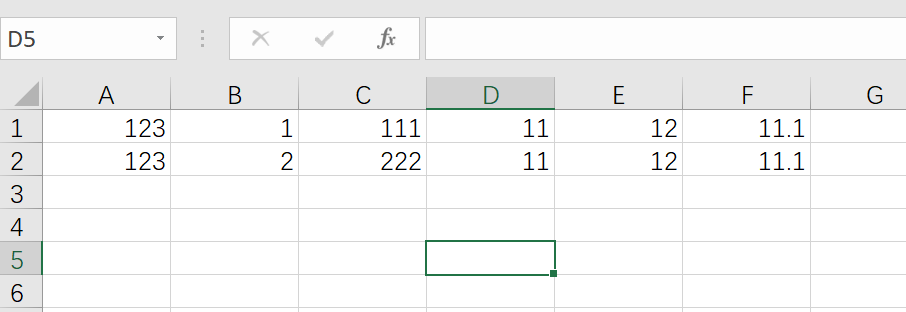
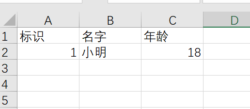

## EasyCsv

EasyCsv 是一个基于Java的简单、省内存的读写 csv 的开源项目。

## 快速开始

maven 依赖

~~~xml

<dependency>
    <groupId>com.github.biyanwen</groupId>
    <artifactId>easycsv</artifactId>
    <version>1.0.0</version>
</dependency>
~~~

### 读 csv

#### 无表头的读/索引读

如果 csv 没有表头的话就只能通过**索引**读取数据了。 csv 无表头示例：

**实体定义**：

~~~java

@Data
public class TestOutputBean {

	@CsvProperty(index = 0)
	private String caseId;

	@CsvProperty(index = 1)
	private Integer dataType;

	@CsvProperty(index = 2)
	private String beanId;

	@CsvProperty(index = 3, size = 3, clazz = BigDecimal.class)
	private List<BigDecimal> list;
}
~~~

需要被赋值的字段必须配置 @CsvProperty 注解，否则会被过滤掉。 index 代表字段的顺序。EasyCsv 能够将多个数据收集到一个集合中(类似 excel 合并单元格)，为此你需要指定 size
的大小，及需要转换成什么类型（因为 Java 类型擦除机制，所以不能自动获取 List 中的泛型类型）,并且必须有**无参构造函数**。

**创建解析器**：

~~~java
public class DemoCsvParser extends AbstractCsvFileParser<TestOutputBean> {
	/**
	 * 每隔3000条存储数据库，然后清理list ，方便内存回收
	 */
	public static final int BATCH_COUNT = 3000;
	/**
	 * 缓存的数据
	 */
	private List<TestOutputBean> cachedData = new ArrayList<>(BATCH_COUNT);
	/**
	 * 假设这个是一个DAO，当然有业务逻辑这个也可以是一个service。当然如果不用存储这个对象没用。
	 */
	private TestOutputDAO testOutputDAO;

	public DemoCsvParser() {
		// 这里是demo，所以随便new一个。实际使用如果到了spring,请使用下面的有参构造函数
		testOutputDAO = new DemoDAO();
	}

	/**
	 * 如果使用了spring,请使用这个构造方法。每次创建Listener的时候需要把spring管理的类传进来
	 *
	 * @param testOutputDAO
	 */
	public DemoCsvParser(TestOutputDAO testOutputDAO) {
		this.testOutputDAO = testOutputDAO;
	}

	/**
	 * 这个每一条数据解析都会来调用
	 */
	@Override
	protected void invoke(T data) {
		cachedData.add(data);
		// 达到BATCH_COUNT了，需要去存储一次数据库，防止数据几万条数据在内存，容易OOM
		if (cachedData.size() >= BATCH_COUNT) {
			saveData();
			// 存储完成清理 list
			cachedData = new ArrayList<>(BATCH_COUNT);
		}
	}

	/**
	 * 所有数据解析完成了 会来调用,防止有数据没有被保存
	 *
	 */
	@Override
	protected void doAfterAllAnalysed() {
		saveData();
	}

	/**
	 * 加上存储数据库
	 */
	private void saveData() {
		testOutputDAO.save(cachedData);
	}
}

~~~

**调用 EasyCsv#read 方法**

~~~java
class EasyCsvTest {

	@Test
	void read() {
		String file = Thread.currentThread().getContextClassLoader().getResource("").getFile();
		String path = new File(file, "/file/TEST_out.csv").getCanonicalPath();

		EasyCsv.read(path, TestOutputBean.class, new DemoCsvParser())
				.doRead();
	}
}
~~~

当然你可能认为每次都创建解析器很麻烦,所以本工具提供了**内置的解析器**,可以直接使用，增加开发效率。 这个解析器是 PageCsvParser 使用方式如下:

~~~java

class EasyCsvTest {

	@Test
	void read() {
		// 这里只是 demo 所以直接 new dao 了
		TestOutputDAO dao = new TestOutputDAO();
		String file = Thread.currentThread().getContextClassLoader().getResource("").getFile();
		String path = new File(file, "/file/TEST_out.csv").getCanonicalPath();

		EasyCsv.read(path, TestOutputBean.class, new PageCsvParser<TestOutputBean>(list -> dao.save(list)))
				.doRead();
	}
}
~~~

##### 跳跃指定行数的读

你可以通过配置，达到从指定行开始读的目的。**这个特性只适用于用索引去读**. 代码示例：

~~~java

class EasyCsvTest {

	@Test
	void read() {
		// 这里只是 demo 所以直接 new dao 了
		TestOutputDAO dao = new TestOutputDAO();
		String file = Thread.currentThread().getContextClassLoader().getResource("").getFile();
		String path = new File(file, "/file/TEST_out.csv").getCanonicalPath();

		EasyCsv.read(path, TestOutputBean.class, new PageCsvParser<TestOutputBean>(list -> dao.save(list)))
				//这里调用 skip 可以跳跃一定行数
				.skip(num)
				.doRead();
	}
}
~~~

#### 有表头的读/通过表头读

当 csv 有表头时可以使用表头读取指定数据。 csv 示例如下：

**定义实体**

~~~java

@Data
public class WriteTestBean {
	@CsvProperty(name = "标识")
	private Integer id;
	@CsvProperty(name = "名字")
	private String name;
	@CsvProperty(name = "年龄")
	private Integer age;

	public WriteTestBean() {
	}

	public WriteTestBean(Integer id, String name, Integer age) {
		this.id = id;
		this.name = name;
		this.age = age;
	}
}
~~~

**调用 EasyCsv#read** 方法

~~~java
class EasyCsvTest {

	@Test
	void read() {
		String file = Thread.currentThread().getContextClassLoader().getResource("").getFile();
		String path = new File(file, "/file/WRITE.csv").getCanonicalPath();

		List<WriteTestBean> list = new ArrayList<>();
		EasyCsv.read(path, WriteTestBean.class, new PageCsvParser<WriteTestBean>(list::addAll))
				.doRead();
	}
}
~~~

### 写 csv

**定义实体**

~~~java

@Data
public class WriteTestBean {
	@CsvProperty(name = "标识")
	private Integer id;
	@CsvProperty(name = "名字")
	private String name;
	@CsvProperty(name = "年龄")
	private Integer age;

	public WriteTestBean() {
	}

	public WriteTestBean(Integer id, String name, Integer age) {
		this.id = id;
		this.name = name;
		this.age = age;
	}
}
~~~

**调用 EasyCsv#write** 方法

~~~java
class EasyCsvTest {

	@Test
	void read() {
		String file = Thread.currentThread().getContextClassLoader().getResource("").getFile();
		String path = new File(file, "/file/WRITE.csv").getCanonicalPath();
		List<WriteTestBean> writeTestBeans = Collections.singletonList(new WriteTestBean(1, "小明", 18));

		EasyCsv.write(path, WriteTestBean.class)
				.doWrite(writeTestBeans);
	}
}
~~~

**结果**

**合并单元格**

其实 csv 中并不存在真正的合并单元格，但是我们可以自己模拟出来相同的功能。唯一不同的就是实体的定义，代码如下：

**定义写实体**:

~~~java

@Data
public class WriteListTestBean {
	@CsvProperty(name = "标识")
	private Integer id;
	@CsvProperty(name = "名字")
	private String name;
	@CsvProperty(name = "朋友们")
	private List<String> friends;
}
~~~

其中“朋友们”就是对合并单元格的模拟，它会将集合中的元素都放在“朋友们”这个表头的下面。之后你通过本工具进行解析的时候，本工具就会自动的将对应的数据收集到“朋友们”这个集合中，这样就达到了合并单元格的效果。

**定义读实体**:

~~~java

@Data
public class WriteListTestBean {
	@CsvProperty(name = "标识")
	private Integer id;
	@CsvProperty(name = "名字")
	private String name;
	@CsvProperty(name = "朋友们")
	private List<String> friends;
}
~~~

合并单元格完整实例代码如下：

~~~java
class EasyCsvTest {

	@Test
	void read() {
		String file = Thread.currentThread().getContextClassLoader().getResource("").getFile();
		String path = new File(file, "/file/WRITE_LIST.csv").getCanonicalPath();

		WriteListTestBean writeListTestBean = new WriteListTestBean();
		writeListTestBean.setId(1);
		writeListTestBean.setName("小黑");
		writeListTestBean.setFriends(Arrays.asList("小明", "胖虎", "小丽"));

		WriteListTestBean writeListTestBeanTwo = new WriteListTestBean();
		writeListTestBeanTwo.setId(2);
		writeListTestBeanTwo.setName("小明");
		writeListTestBeanTwo.setFriends(Arrays.asList("小黑", "胖虎", "小丽"));

		List<WriteListTestBean> writeListTestBeans = Arrays.asList(writeListTestBean, writeListTestBeanTwo);
		EasyCsv.write(path, WriteListTestBean.class).doWrite(writeListTestBeans);

		List<ReadListTestBean> list = new ArrayList<>();
		EasyCsv.read(path, ReadListTestBean.class, new PageCsvParser<ReadListTestBean>(list::addAll))
				.doRead();
		assertEquals(2, list.size());
		assertEquals(3, list.get(0).getFriends().size());
	}
}
~~~
ps: 合并单元格只是本项目对其功能进行的模拟，本项目提供生成和解析的功能，所以你用一些编辑器打开 csv 后并不能渲染出真正的合并单元格的效果。
更多使用示例请查看本项目的测试类 EasyCsvTest。

